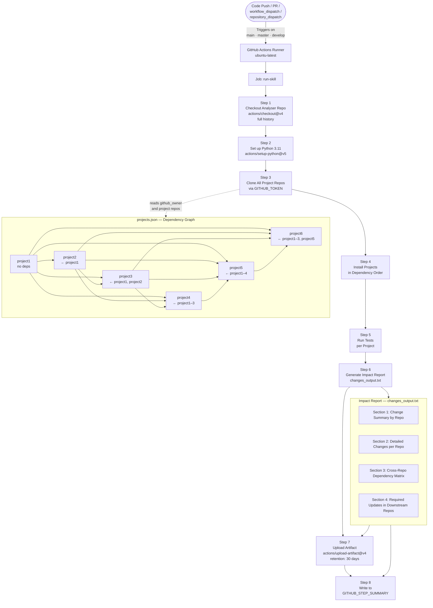

# CI/CD Pipeline — GitHub Actions

This workflow (`ci-cd.yml`) is the **GitHub Actions** equivalent of the Azure DevOps pipeline. It clones multiple interdependent Python repositories defined in `projects.json`, installs them in dependency order, runs their tests, and publishes a **Multi-Repository Impact Report** to the job summary and as a downloadable artifact.

---

## Architecture



---

## Workflow Triggers

| Event | Branches / Condition |
|-------|----------------------|
| `push` | `main`, `master`, `develop` |
| `pull_request` | `main`, `master` |
| `workflow_dispatch` | Manual run from the Actions tab |
| `repository_dispatch` | External event type `project-updated` (e.g. triggered by another repo's workflow) |

The `repository_dispatch` trigger enables **cross-repository chaining** — when any upstream project publishes a release or completes its own CI, it can fire a `repository_dispatch` event to this analyser to re-evaluate the full impact graph immediately.

---

## Step-by-Step Process

### Step 1 — Checkout Analyser Repository
Uses `actions/checkout@v4` with `fetch-depth: 0` (full git history) so that `git diff HEAD~1` comparisons in later steps work correctly across all cloned repos.

### Step 2 — Set up Python 3.11
Uses `actions/setup-python@v5` to install Python **3.11** and add it to `PATH`.

### Step 3 — Clone All Project Repositories
Reads `github_owner` from `projects.json` and clones each repository from GitHub using the workflow's `GITHUB_TOKEN` (available automatically for the repository):

```bash
git clone https://github.com/<owner>/<repo>.git <repo>
# Fallback to GitHub CLI if direct clone fails:
gh repo clone <owner>/<repo> <repo>
```

The `GH_TOKEN` environment variable is set from `${{ secrets.GITHUB_TOKEN }}` so both `git` and `gh` can authenticate without extra secrets configuration.

### Step 4 — Install Projects in Dependency Order
Iterates the project list from `projects.json` (already ordered by dependency depth) and pip-installs each available directory:

```bash
pip install -e ./<project>   # editable install preferred
# falls back to: pip install ./<project>
```

Installing upstream packages first ensures all imports resolve correctly for downstream packages.

### Step 5 — Run Tests
Executes the `test_command` for each project defined in `projects.json`. Failures emit a warning but do not stop the loop, so every project is tested regardless:

```bash
# Example test commands from projects.json
python -c "from project1 import greet; print(greet('CI'))"
python -c "from project2 import enhanced_greet; print(enhanced_greet('CI'))"
python -c "from project5 import ultra_greet; print(ultra_greet('CI'))"
```

### Step 6 — Generate Impact Report
Writes `changes_output.txt` in the workspace root with four sections:

| Section | Content |
|---------|---------|
| **1 — Change Summary** | Markdown table: repo · files changed · change type (Feature / Bugfix / Refactor / Update detected from commit message) · last commit subject |
| **2 — Detailed Changes** | Per-repo: commit hash, modified files, Python functions/classes added (`➕`) or removed (`➖`) detected via `git diff HEAD~1` |
| **3 — Dependency Matrix** | Full cross-repo table: what each repo depends on, what depends on it, and whether breaking changes were detected |
| **4 — Required Updates** | For every repo with new commits, lists downstream repos that import it and recommends actions (adopt new functions, update version pins, re-run tests) |

Change type is inferred from the commit message keyword:

| Keyword in commit | Reported type |
|-------------------|--------------|
| `feat`            | Feature      |
| `fix`             | Bugfix       |
| `refactor`        | Refactor     |
| *(anything else)* | Update       |

### Step 7 — Upload Artifact
Uses `actions/upload-artifact@v4` to upload `changes_output.txt` as the **`impact-report`** artifact. The artifact is retained for **30 days** and is downloadable from the **Artifacts** section of the workflow run.

```yaml
- uses: actions/upload-artifact@v4
  with:
    name: impact-report
    path: changes_output.txt
    retention-days: 30
```

### Step 8 — Write to Job Summary
Appends the full report content to `$GITHUB_STEP_SUMMARY`, making it visible directly in the GitHub Actions run UI without downloading anything:

```bash
echo "## 📊 Multi-Repository Impact Report" >> $GITHUB_STEP_SUMMARY
cat changes_output.txt >> $GITHUB_STEP_SUMMARY
echo "📥 **Download full report:** Check the Artifacts section below" >> $GITHUB_STEP_SUMMARY
```

---

## Required Secrets / Permissions

| Secret / Token | Purpose | Source |
|----------------|---------|--------|
| `GITHUB_TOKEN` | Clone repositories, authenticate `gh` CLI | Automatically provided by GitHub Actions — no setup needed |

No additional secrets are required for public repositories. For **private repositories**, the default `GITHUB_TOKEN` only has access to the repository where the workflow runs. To clone other private repos, create a **Personal Access Token (PAT)** with `repo` scope and store it as a repository secret (e.g. `secrets.PAT_TOKEN`), then update the `GH_TOKEN` env reference in the workflow.

---

## Comparison with Azure DevOps Pipeline

| Feature | GitHub Actions (`ci-cd.yml`) | Azure DevOps (`azure-pipelines.yml`) |
|---------|------------------------------|--------------------------------------|
| Runner | `ubuntu-latest` (hosted) | Self-hosted pool `Default1` |
| Auth for cloning | `GITHUB_TOKEN` (auto) | `System.AccessToken` (auto) |
| Clone source | `github.com/<owner>/<repo>` | `dev.azure.com/<org>/<project>/_git/<repo>` |
| Report output | `$GITHUB_STEP_SUMMARY` + artifact | Pipeline summary + artifact |
| Artifact retention | 30 days | Default pipeline retention |
| Extra trigger | `workflow_dispatch`, `repository_dispatch` | Manual run only |
| Parallelism | Free (GitHub-hosted) | Requires free parallelism grant |

---

## Getting Started

1. Ensure `projects.json` at the repository root has the correct `github_owner` and project list.
2. Push or open a pull request to `main`, `master`, or `develop`.
3. Navigate to **Actions → CI/CD Pipeline** to view the run.
4. Click the run → **Summary** tab to see the inline impact report.
5. Download `impact-report` from the **Artifacts** section for the full `changes_output.txt`.

To trigger the workflow manually:
1. Go to **Actions → CI/CD Pipeline → Run workflow**.

To trigger from another repository's workflow (cross-repo chaining):
```yaml
- name: Notify multi-repo-analyser
  uses: peter-evans/repository-dispatch@v3
  with:
    token: ${{ secrets.PAT_TOKEN }}
    repository: <owner>/multi-repo-analyser
    event-type: project-updated
```

---

## Output Example

```
═══════════════════════════════════════════════════════════════
📊 MULTI-REPOSITORY IMPACT REPORT
═══════════════════════════════════════════════════════════════
Generated: Tue Jul 15 10:30:00 UTC 2026

## 📝 Change Summary by Repository
| Repository | Files Changed | Change Type | Last Commit              |
|-----------|---------------|-------------|--------------------------|
| project1  | 2             | Feature     | feat: add greet_all helper |
| project3  | 0             | Update      | N/A                      |

## 📂 Detailed Changes Per Repository (Latest Commit Only)
### 📦 project1
**Last Commit:** a1b2c3d - feat: add greet_all helper (Jane Doe, 2 hours ago)
**Files Modified:**
- `project1/__init__.py`
**Code Changes:**
  📄 `project1/__init__.py`:
    ➕ Added: def greet_all

## 🔗 Cross-Repository Dependencies
| Repository | Depends On    | Depended By                                       | Breaking Changes |
|-----------|---------------|---------------------------------------------------|------------------|
| project1  | None          | project2, project3, project4, project5, project6  | No               |

## 🔄 Required Updates in Dependent Projects
### 📦 Changes in `project1` affect:
#### 🎯 `project2`
**Impact:** This project imports from `project1`
**New functions available to use:**
from project1 import greet_all
**Recommended Actions:**
- ✅ Consider using new functions: `greet_all`
- ✅ Update version requirement if needed
- ⚠️ Run tests to ensure compatibility

### Dependency Notes
- ⚠️ Changes to **project1** will impact: project2, project3, project4, project5, project6

═══════════════════════════════════════════════════════════════
✅ Report generated at: Tue Jul 15 10:30:05 UTC 2026
═══════════════════════════════════════════════════════════════
```
