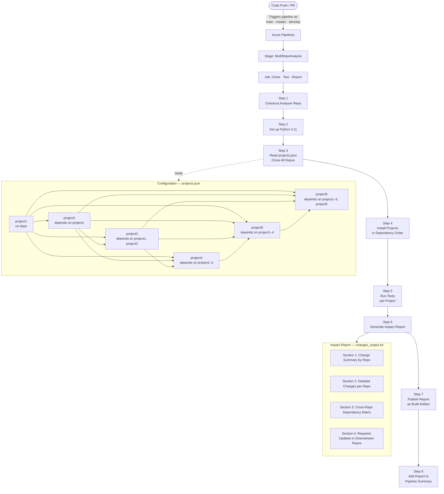

# Multi-Repository Impact Analyser

An Azure DevOps pipeline tool that automatically clones multiple interdependent repositories, runs their tests in dependency order, and generates a comprehensive **cross-repository impact report** showing what changed, what is affected, and what downstream updates are required.

---

## Architecture



---

## Project Dependency Graph

| Repository | Depends On               | Depended By                    |
|------------|--------------------------|--------------------------------|
| project1   | —                        | project2, project3, project4, project5, project6 |
| project2   | project1                 | project3, project4, project5, project6 |
| project3   | project1, project2       | project4, project5, project6   |
| project4   | project1, project2, project3 | project5                   |
| project5   | project1, project2, project3, project4 | project6        |
| project6   | project1, project2, project3, project5 | —               |

---

## Step-by-Step Pipeline Process

### Step 1 — Checkout Analyser Repository
The pipeline checks out this repository (full history with `fetchDepth: 0`) so that `projects.json` and the pipeline definition are available to all subsequent steps.

### Step 2 — Set up Python
Installs and activates Python **3.11** on the agent using the `UsePythonVersion@0` task.

### Step 3 — Clone All Project Repositories
Reads `projects.json` to extract the Azure DevOps organisation, project, and repository list. Each repository is cloned using the pipeline's system access token:

```bash
git clone https://$(System.AccessToken)@dev.azure.com/<org>/<project>/_git/<repo> <repo>
```

Repositories that cannot be cloned emit a warning but do not fail the pipeline.

### Step 4 — Install All Projects
Iterates the project list from `projects.json` (which is already defined in dependency order) and pip-installs each one in editable mode:

```bash
pip install -e ./<project>
```

Installing in order guarantees that upstream packages are available when downstream packages are installed.

### Step 5 — Run Tests
Executes the `test_command` defined for each project in `projects.json`. A test failure emits a warning but does not halt the pipeline, so all projects are tested regardless.

```bash
# Example test commands
python -c "from project1 import greet; print(greet('CI'))"
python -c "from project2 import enhanced_greet; print(enhanced_greet('CI'))"
```

### Step 6 — Generate Impact Report
Produces `changes_output.txt` in four sections:

| Section | Content |
|---------|---------|
| **1 — Change Summary** | Table: repo · files changed · change type (Feature / Bugfix / Refactor / Update) · last commit message |
| **2 — Detailed Changes** | Per-repo: commit hash, modified files, added/removed Python functions/classes detected via `git diff` |
| **3 — Dependency Matrix** | Full cross-repo table: what each repo depends on and what depends on it |
| **4 — Required Updates** | For every repo with new commits, lists downstream repos that import it and recommends actions (use new functions, update version pin, re-run tests) |

### Step 7 — Publish Artifact
Uploads `changes_output.txt` as the **`ImpactReport`** build artifact using `PublishBuildArtifacts@1`. The report is accessible from the Azure DevOps build summary page.

### Step 8 — Add to Pipeline Summary
Attaches the report to the pipeline run summary via `##vso[task.uploadsummary]` so it is visible directly in the Azure DevOps UI without downloading the artifact.

---

## Configuration — `projects.json`

```jsonc
{
  "azure_devops": {
    "organization": "<your-org>",
    "project": "<your-project>"
  },
  "projects": [
    {
      "name": "project1",
      "repo": "project1",
      "path": "./project1",
      "dependencies": [],
      "test_command": "python -c \"from project1 import greet; print(greet('CI'))\"",
      "export_function": "greet"
    }
    // ... additional projects in dependency order
  ]
}
```

| Field            | Description                                              |
|------------------|----------------------------------------------------------|
| `name`           | Logical name used in reports and dependency resolution   |
| `repo`           | Azure DevOps repository name to clone                    |
| `path`           | Local path after cloning                                 |
| `dependencies`   | List of `name` values this project depends on            |
| `test_command`   | Shell command to validate the project                    |
| `export_function`| Primary exported function (used in impact summaries)     |

---

## Pipeline Trigger

| Event | Branches               |
|-------|------------------------|
| Push  | `main`, `master`, `develop` |
| PR    | `main`, `master`       |

Agent pool: **`Default1`** (self-hosted). To switch to a Microsoft-hosted agent, replace `name: 'Default1'` with `vmImage: 'ubuntu-latest'` in `azure-pipelines.yml` and ensure your organisation has a free parallelism grant ([request here](https://aka.ms/azpipelines-parallelism-request)).

---

## Getting Started

1. **Fork / import** this repository into your Azure DevOps project.
2. **Edit `projects.json`** — set your `azure_devops.organization` and `azure_devops.project`, then list your repositories in dependency order.
3. **Configure agent pool** — update the `pool.name` in `azure-pipelines.yml` to match your agent pool.
4. **Create a pipeline** in Azure DevOps pointing to `azure-pipelines.yml`.
5. **Push a change** to any watched branch — the pipeline runs and publishes the impact report as a build artifact.

---

## Output Example

```
═══════════════════════════════════════════════════════════════
📊 MULTI-REPOSITORY IMPACT REPORT (Azure DevOps)
═══════════════════════════════════════════════════════════════
Generated: Tue Jul 15 10:30:00 UTC 2026
Build ID: 42

## 📝 Change Summary by Repository
| Repository | Files Changed | Change Type | Last Commit |
|-----------|---------------|-------------|-------------|
| project1  | 2             | Feature     | feat: add greet_all helper |

## 🔗 Cross-Repository Dependencies
| Repository | Depends On    | Depended By                              |
|-----------|---------------|------------------------------------------|
| project1  | None          | project2, project3, project4, project5, project6 |

## 🔄 Required Updates in Dependent Projects
### 📦 Changes in `project1` affect:
#### 🎯 `project2`
**New functions available to use:**
from project1 import greet_all
```
